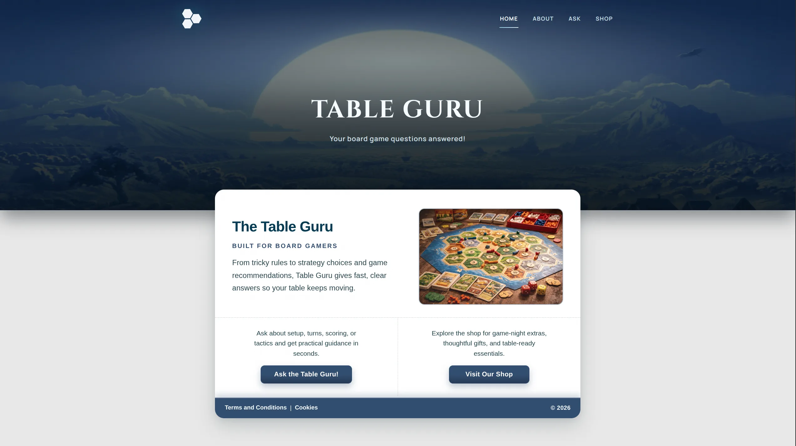

# Table Guru


Table Guru is a board-game companion web app that helps players:

- ask gameplay questions and get AI-generated answers
- discover board-game related products in the shop

## Table of Contents

- [Features](#features)
- [Tech Stack](#tech-stack)
- [Project Structure](#project-structure)
- [Team](#team)

## Features

- Responsive navigation with mobile menu
- Ask page with:
  - character counting
  - loading state
  - API-backed AI responses
- Shop page with:
  - search
  - offer shortcut
  - sorting
  - API-backed product cards (image, title, description, stars, price)
- About and Home pages with shared component styling

## Tech Stack

- HTML5
- CSS3
- Vanilla JavaScript (ES modules, `fetch`, class-based UI logic)

## Project Structure

```text
.
├── index.html
├── ask/index.html
├── shop/index.html
├── about/index.html
├── css/
├── js/
│   ├── api.js
│   ├── ask.js
│   ├── shop.js
│   └── script.js
└── public/
    ├── images/
    └── svg/
```

## Team

- Qingling
- Alperen
- Alex
